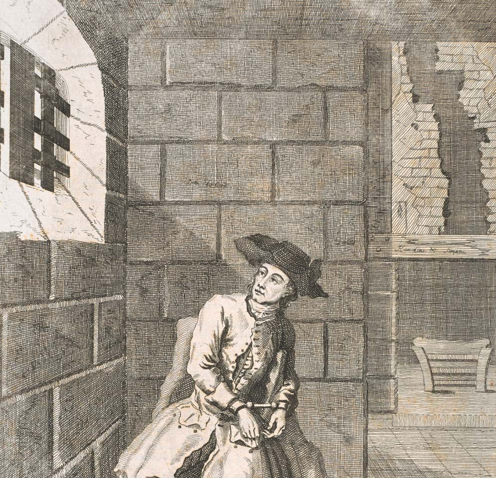

## Background

Since The Beggar’s Opera was first staged in 1728, it has been, along with Gulliver’s Travels and Robinson Crusoe, among the most influential and enduring texts from the English eighteenth century and indeed in the whole of English Literature.  It has been performed countless times by professional and amateur troupes; it has been printed and reprinted in innumerable editions; and it has inspired adaptations from a remarkable range of artists, among them Bertolt Brecht, Elizabeth Hauptmann, and Kurt Weill’s Threepenny Opera (1928), Duke Ellington and John La Touche’s Beggar’s Holiday (1946), Vaclav Havel’s Žebrácká Opera (1975), Wole Soyinka’s Opera Wonyosi (1977), and Stephen Jeffreys’ The Convict’s Opera (2008). It remains a vibrant presence on the stage, performed at the Edinburgh Festival in 2018 and the next year the adaptation Dead Dog in a Suitcase was re-staged at the Lyric Hammersmith, site of the famous revival in 1921 that inspired The Threepenny Opera.  The play also continues to spark interest in other countries; The Beggar’s Opera was staged at Versailles in 2019, and last year in Paris Helene Ducos performed her adaptation, “Minuit Montmartre:  Rag-Opera.”  

If we wish to understand the origins of the modern musical or political satire and the continuing relevance of Gay’s play to our time, we must study it.  Yet despite its ubiquity, importance, and congeniality to a digital environment where its blend of text, music, and image might properly be brought to life, no site has yet realized the play’s potential to inform and stimulate students and scholars or brought together authoritative editions of the text and music.  This will also be one of the few digital projects bringing together music, text, and image, and will thus be useful to others seeking to do the same.
